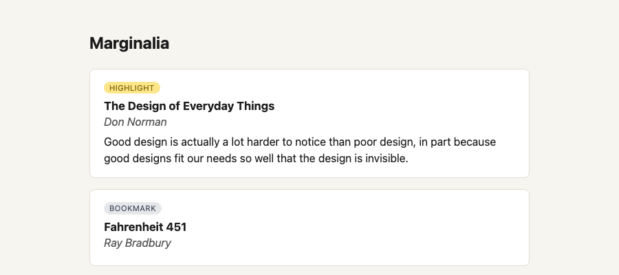

# Marginalia — a Claude Code mastery project

A deliberate-practice repo. The software is real, but it exists to give a set of
Claude Code techniques something to bite on.

**Stack:** TypeScript, Node 22+, Vitest, Fastify, React + Vite, SQLite, Playwright.
**Pace:** 2–4 hrs/week, one or two ~90-minute sessions. Roughly 4–5 months end to end.

---

## The objective

Most people use Claude Code as a faster autocomplete. The techniques below turn it
into something closer to an engineer you delegate outcomes to. They only work if the
project is hard enough to expose the failure modes, so this repo escalates
deliberately: pure functions → persistence → UI → performance → parallelism →
migration → automation.

By the end you should be able to, without looking anything up:

1. **Wire verification before writing features.** Give Claude a reliable way to
   check its own work — tests, a screenshot diff, a benchmark — and quality
   compounds. This is the highest-leverage habit in the whole list.
2. **Set a verifiable end state and walk away.** `/goal` keeps a session running
   across turns until a separate evaluator model confirms your condition holds.
   Conditions like _"`npm test` exits 0 and p95 stays under 300ms"_ work; _"make it
   fast"_ does not.
3. **Run 3–5 sessions in parallel without collisions.** `claude --worktree <name>`
   puts each session in its own git worktree; `isolation: worktree` does the same
   for a subagent.
4. **Keep context lean.** A short `CLAUDE.md` plus progressive disclosure beats a
   sprawling rulebook. Newer models need less hand-holding, not more — periodically
   delete rules and see what breaks.
5. **Know the escape hatches.** `Esc` to halt a drifting agent, `/rewind` to roll
   back code and conversation to a checkpoint.
6. **Package what works.** Skills, hooks, and `/loop` turn one good session into a
   repeatable routine.
7. **Find your own gaps first.** The bottleneck is increasingly your spec, not the
   model. Blind-spot passes, interview mode, throwaway prototypes.

Source of the ideas: Addy Osmani's _Claude Code Pro-Tips_. Command behaviour here
is checked against [code.claude.com/docs](https://code.claude.com/docs/en/overview)
— verify anything that looks off, since the tool moves fast.

---

## What you're building

**Marginalia** ingests markdown highlight exports (Kindle, Readwise, hand-written
notes), makes them searchable, and serves them through an API and a small web UI.



It was chosen because each technique needs a specific affordance:

| Technique               | What the project provides                              |
| ----------------------- | ------------------------------------------------------ |
| Verification loops      | Pure parser functions with obvious correct answers     |
| `/goal`                 | A failing test suite with a binary pass condition      |
| Screenshot verification | A real UI to diff against a spec                       |
| Performance goals       | Full-text search with a measurable p95                 |
| Parallel worktrees      | Three independent features that don't touch each other |
| `/batch` + subagents    | A schema migration across many call sites              |
| Hooks & routines        | Format-on-save, CI babysitting, dependency audits      |

---

## The stages

Each stage has an **exit condition** — something you can check, not a feeling.
Don't advance until it holds.

### Stage 1 — Verification before features

Bootstrap the repo, write the highlight parser, and build one verification skill
before writing a single feature. Practice: lean `CLAUDE.md`, `/init`, `/context`.
**Exit:** `npm test` runs green from a cold clone, and `.claude/skills/verify-parser/`
exists and is invoked by name in a session.

### Stage 2 — Autonomous goals

Introduce three deliberate bugs. Set a `/goal` and let Claude drive to green without
per-turn prompting. Pair with auto mode so tool calls don't block. Practice: writing
conditions the evaluator can actually judge from the transcript.
**Exit:** one `/goal` run reaching its condition in ≥5 unattended turns, transcript saved
to `docs/logs/`.

### Stage 3 — Persistence and hooks

Add SQLite storage, a Fastify API, and a `PostToolUse` hook that formats and
type-checks on every edit. Practice: hooks, permission pre-approval.
**Exit:** an edit that breaks types is caught by the hook, not by you.

**Try it:** `npm run start`, then `POST /clippings/import` with `{"text": "<raw export>"}`
and `GET /clippings` to see what landed.

### Stage 4 — Visual verification

React + Vite front end. Wire Playwright so Claude can screenshot a route and diff it
against the spec. Practice: giving Claude eyes; `/simplify` after changes.
**Exit:** Claude catches a layout regression you did not point out.

### Stage 5 — Performance as a goal

Full-text search over 10k+ highlights. Write a benchmark first, then
`/goal p95 search latency is under 300ms and all tests pass`.
**Exit:** benchmark output in the transcript showing the target met, no test regressions.

### Stage 6 — Parallelism

Three independent features (tag filtering, export to markdown, a stats endpoint), one
per worktree, run concurrently. Practice: `claude --worktree`, `.worktreeinclude` for
`.env`, merge discipline.
**Exit:** three branches merged in one sitting with no manual conflict resolution.

### Stage 7 — Migration at scale

Restructure the highlight schema across every call site. Use `/batch` and a
`isolation: worktree` subagent for the mechanical work. Practice: scoping a migration
so an agent can't half-finish it.
**Exit:** migration lands green, and you used `/rewind` at least once to undo a bad path.

### Stage 8 — Automation and the context diet

Package the routines: `/loop` for CI babysitting, a `.claude/loop.md`, a scheduled
dependency audit. Then delete: run `/doctor`, cut `CLAUDE.md` hard, remove skills you
haven't invoked, and re-run the suite to see what actually mattered.
**Exit:** `CLAUDE.md` is smaller than it was at Stage 3 and the test suite still passes.

---

## How to work a session

1. Open `TRACKER.md`, pick the current stage, read its exit condition.
2. Start Claude in a worktree if the work is isolatable: `claude --worktree stage-N`.
3. Before building anything fuzzy, ask for a **blind-spot pass**: _"what am I not
   accounting for here? Ask me one question at a time."_
4. Don't accept the first answer. _"Prove this works." "Grill me on this design."
   "Now do the elegant version."_
5. If Claude loops on the same failing fix twice, hit `Esc`. If the last few turns
   made things worse, `/rewind`.
6. Log the session in `TRACKER.md` before you close the terminal. This is the part
   everyone skips and it's the part that makes the repo worth having.

## Setup

```bash
git init
git add -A && git commit -m "Seed Claude Code mastery project"
gh repo create marginalia --private --source=. --push   # optional

npm init -y
claude          # accept the trust dialog first — /goal needs it
```
